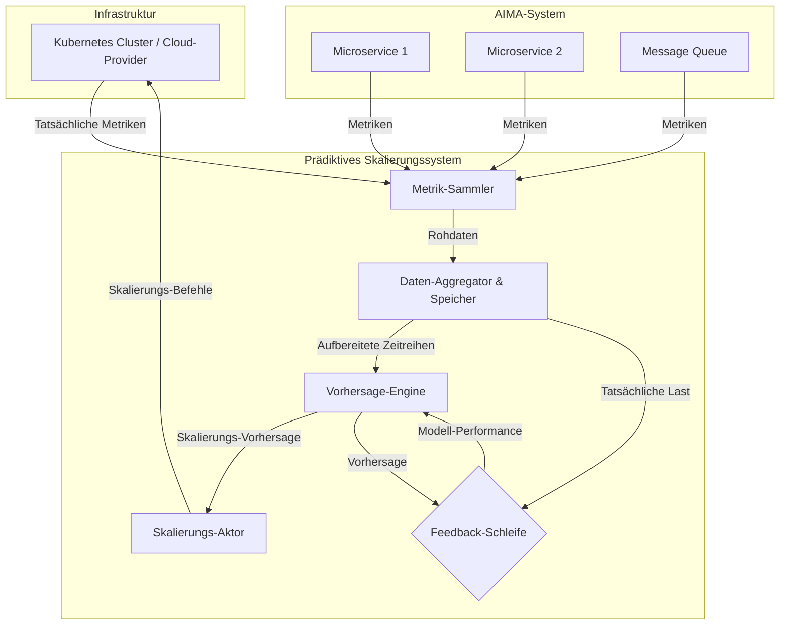

# Prädiktive Skalierung

Dieses Dokument spezifiziert den Algorithmus und die Parameter für die prädiktive Skalierung im AIMA-System.

## 1. Übersicht

Die prädiktive Skalierung ist ein fortschrittlicher Mechanismus, der es dem AIMA-System ermöglicht, Ressourcenbedarfe vorherzusagen und proaktiv zu skalieren, bevor Engpässe auftreten. Im Gegensatz zur reaktiven Skalierung, die erst auf bereits eingetretene Lastspitzen reagiert, antizipiert die prädiktive Skalierung zukünftige Bedarfe und stellt rechtzeitig die erforderlichen Ressourcen bereit.

### 1.1 Vorteile der prädiktiven Skalierung

- **Verbesserte Benutzererfahrung**: Reduzierung von Wartezeiten durch vorausschauende Ressourcenbereitstellung
- **Kostenoptimierung**: Effizientere Ressourcennutzung durch präzise Vorhersagen
- **Lastspitzenabdeckung**: Bessere Bewältigung von vorhersehbaren Lastspitzen
- **Stabilität**: Vermeidung von Überlastungssituationen und damit verbundenen Systeminstabilitäten
- **Energieeffizienz**: Optimierte Ressourcennutzung führt zu geringerem Energieverbrauch

## 2. Vorhersagemodell

### 2.1 Modelltypen

Das AIMA-System verwendet eine Kombination verschiedener Vorhersagemodelle, die je nach Anwendungsfall und verfügbaren Daten ausgewählt werden:

#### 2.1.1 Zeitreihenanalyse

Für regelmäßige Muster und saisonale Trends:

- **ARIMA (AutoRegressive Integrated Moving Average)**: Für kurzfristige Vorhersagen basierend auf historischen Daten
- **SARIMA (Seasonal ARIMA)**: Für Daten mit saisonalen Komponenten (z.B. tägliche oder wöchentliche Muster)
- **Prophet**: Für robuste Vorhersagen mit mehreren saisonalen Mustern und Feiertagen

#### 2.1.2 Maschinelles Lernen

Für komplexere Muster und multivariate Abhängigkeiten:

- **Gradient Boosting (XGBoost, LightGBM)**: Für präzise Vorhersagen mit vielen Einflussfaktoren
- **LSTM (Long Short-Term Memory)**: Für sequenzielle Daten mit langfristigen Abhängigkeiten
- **Random Forest**: Für robuste Vorhersagen mit geringem Overfitting-Risiko

### 2.2 Hybrides Ensemble-Modell

Das AIMA-System kombiniert mehrere Modelle zu einem Ensemble, um die Vorhersagegenauigkeit zu maximieren:

```python
class PredictiveScalingEnsemble:
    def __init__(self, models=None, weights=None):
        self.models = models or []
        self.weights = weights or []
        self.model_performance = {}
        self.adaptive_weights = False
    
    def add_model(self, model, weight=1.0):
        self.models.append(model)
        self.weights.append(weight)
        self.model_performance[model.name] = {
            'rmse': [],
            'mae': [],
            'mape': []
        }
    
    def enable_adaptive_weights(self, window_size=10):
        self.adaptive_weights = True
        self.performance_window_size = window_size
    
    def predict(self, features, horizon=1):
        if not self.models:
            raise ValueError("No models in ensemble")
        
        predictions = []
        for model in self.models:
            model_pred = model.predict(features, horizon)
            predictions.append(model_pred)
        
        # Wenn adaptive Gewichtung aktiviert ist, Gewichte basierend auf
        # der jüngsten Performance anpassen
        if self.adaptive_weights and all(len(self.model_performance[m.name]['rmse']) >= 1 for m in self.models):
            self._update_weights()
        
        # Gewichtete Kombination der Vorhersagen
        weighted_pred = np.zeros_like(predictions[0])
        for i, pred in enumerate(predictions):
            weighted_pred += pred * self.weights[i]
        
        return weighted_pred
    
    def _update_weights(self):
        # Berechne inverse RMSE für jedes Modell (niedrigerer RMSE = höheres Gewicht)
        inverse_rmse = []
        for model in self.models:
            # Verwende die letzten n Performancewerte
            recent_rmse = self.model_performance[model.name]['rmse'][-self.performance_window_size:]
            avg_rmse = np.mean(recent_rmse)
            inverse_rmse.append(1.0 / (avg_rmse + 1e-10))  # Verhindere Division durch Null
        
        # Normalisiere die Gewichte, damit sie sich zu 1 summieren
        total = sum(inverse_rmse)
        self.weights = [w / total for w in inverse_rmse]
    
    def update_performance(self, actual_values):
        for i, model in enumerate(self.models):
            pred = model.last_prediction
            if pred is not None and len(pred) == len(actual_values):
                rmse = np.sqrt(np.mean((pred - actual_values) ** 2))
                mae = np.mean(np.abs(pred - actual_values))
                mape = np.mean(np.abs((actual_values - pred) / (actual_values + 1e-10))) * 100
                
                self.model_performance[model.name]['rmse'].append(rmse)
                self.model_performance[model.name]['mae'].append(mae)
                self.model_performance[model.name]['mape'].append(mape)
```

## 3. Architektur des Skalierungssystems

Die prädiktive Skalierung wird durch ein dediziertes Subsystem realisiert, das aus mehreren interagierenden Komponenten besteht. Dieses System läuft parallel zur eigentlichen AIMA-Anwendung und steuert deren Ressourcen.



### 3.1 Komponenten

1.  **Metrik-Sammler (Metric Collector):**
    *   **Aufgabe:** Sammelt kontinuierlich Rohmetriken von allen relevanten Quellen (AIMA-Microservices, Kubernetes, Message Queues, Datenbanken).
    *   **Technologien:** Prometheus Exporter, Telegraf, Cloud-Provider-spezifische Agenten.

2.  **Daten-Aggregator & Speicher (Data Aggregator & Storage):**
    *   **Aufgabe:** Empfängt die Rohdaten, aggregiert sie in sinnvolle Zeitintervalle (z.B. pro Minute) und speichert sie effizient für die Analyse.
    *   **Technologien:** Prometheus oder InfluxDB als Zeitreihendatenbank (Time-Series Database, TSDB).

3.  **Vorhersage-Engine (Prediction Engine):**
    *   **Aufgabe:** Das Herzstück des Systems. Greift auf die historischen Daten im Speicher zu, trainiert die unter Abschnitt 2 beschriebenen Modelle (ARIMA, LSTM etc.) und generiert regelmäßig Vorhersagen für den zukünftigen Ressourcenbedarf.
    *   **Implementierung:** Ein separater Service, der in Python mit Bibliotheken wie `scikit-learn`, `statsmodels`, `tensorflow/pytorch` und `xgboost` implementiert ist.

4.  **Skalierungs-Aktor (Scaling Actuator):**
    *   **Aufgabe:** Nimmt die Vorhersagen der Engine entgegen (z.B. "Benötigt in 15 Minuten 5 Instanzen des Gesichtserkennungs-Service") und übersetzt sie in konkrete Aktionen auf der Infrastrukturebene.
    *   **Implementierung:** Interagiert direkt mit der Kubernetes-API, um die `replicas`-Anzahl von Deployments anzupassen, oder mit Cloud-Provider-APIs, um VM-basierte Worker-Gruppen zu skalieren.

5.  **Feedback-Schleife (Feedback Loop):**
    *   **Aufgabe:** Vergleicht die von der Engine gemachten Vorhersagen mit den später tatsächlich eingetretenen Metriken. Berechnet die Performance der Vorhersagemodelle (z.B. mittels RMSE, MAE) und stellt diese Information der Engine zur Verfügung, um die Modelle (insbesondere die Gewichte im Ensemble-Modell) kontinuierlich zu verbessern.
    *   **Implementierung:** Ein Batch-Job oder ein Stream-Prozessor, der die Vorhersagen mit den tatsächlichen Werten aus der TSDB abgleicht.

## 4. Eingabeparameter

### 3.1 Historische Nutzungsdaten

Die prädiktive Skalierung verwendet folgende historische Daten:

| Datentyp | Beschreibung | Zeitraum |
|----------|-------------|----------|
| CPU-Auslastung | Prozentsatz der CPU-Nutzung pro Service | 30 Tage |
| Speichernutzung | RAM-Verbrauch pro Service | 30 Tage |
| GPU-Auslastung | Prozentsatz der GPU-Nutzung | 30 Tage |
| GPU-Speichernutzung | Belegter GPU-Speicher | 30 Tage |
| Anfragerate | Anzahl der Anfragen pro Zeiteinheit | 30 Tage |
| Warteschlangenlänge | Anzahl der Jobs in der Warteschlange | 30 Tage |
| Verarbeitungszeit | Durchschnittliche Verarbeitungszeit pro Job | 30 Tage |

### 3.2 Kontextuelle Faktoren

Zusätzlich zu den historischen Daten werden folgende kontextuelle Faktoren berücksichtigt:

| Faktor | Beschreibung | Einfluss |
|--------|-------------|----------|
| Tageszeit | Stunde des Tages (0-23) | Tägliche Nutzungsmuster |
| Wochentag | Tag der Woche (0-6) | Wöchentliche Nutzungsmuster |
| Monat | Monat des Jahres (1-12) | Saisonale Trends |
| Feiertage | Binärer Indikator für Feiertage | Reduzierte oder erhöhte Aktivität |
| Geplante Events | Bekannte Events mit Auswirkung auf die Nutzung | Erwartete Lastspitzen |
| Systemwartung | Geplante Wartungsarbeiten | Reduzierte Kapazität |
| Neue Funktionen | Einführung neuer Systemfunktionen | Potenzielle Nutzungsänderungen |

### 3.3 Systemmetriken

Folgende Systemmetriken fließen in die Vorhersage ein:

| Metrik | Beschreibung | Verwendung |
|--------|-------------|------------|
| Latenz | Antwortzeit des Systems | Indikator für Systemlast |
| Fehlerrate | Prozentsatz fehlgeschlagener Anfragen | Indikator für Systemprobleme |
| Durchsatz | Verarbeitete Anfragen pro Sekunde | Kapazitätsindikator |
| Ressourceneffizienz | Verhältnis von Leistung zu Ressourcenverbrauch | Optimierungsindikator |
| Netzwerkauslastung | Netzwerkdurchsatz und -latenz | Kommunikationsengpässe |

## 4. Vorhersagealgorithmus

### 4.1 Datenvorverarbeitung

Vor der Anwendung der Vorhersagemodelle werden die Daten wie folgt vorverarbeitet:

```python
class DataPreprocessor:
    def __init__(self, config=None):
        self.config = config or {
            'imputation_method': 'linear',  # 'linear', 'mean', 'median', 'mode'
            'scaling_method': 'minmax',     # 'minmax', 'standard', 'robust'
            'outlier_detection': 'iqr',     # 'iqr', 'zscore', 'isolation_forest'
            'feature_engineering': True,
            'dimensionality_reduction': None  # 'pca', 'tsne', None
        }
        self.scalers = {}
        self.feature_importances = {}
    
    def preprocess(self, data, is_training=True):
        # Behandlung fehlender Werte
        data = self._handle_missing_values(data)
        
        # Ausreißererkennung und -behandlung
        data = self._handle_outliers(data)
        
        # Feature-Engineering
        if self.config['feature_engineering']:
            data = self._engineer_features(data)
        
        # Skalierung
        data = self._scale_features(data, is_training)
        
        # Dimensionsreduktion (optional)
        if self.config['dimensionality_reduction']:
            data = self._reduce_dimensions(data, is_training)
        
        return data
    
    def _handle_missing_values(self, data):
        if self.config['imputation_method'] == 'linear':
            return data.interpolate(method='linear')
        elif self.config['imputation_method'] == 'mean':
            return data.fillna(data.mean())
        elif self.config['imputation_method'] == 'median':
            return data.fillna(data.median())
        elif self.config['imputation_method'] == 'mode':
            return data.fillna(data.mode().iloc[0])
        else:
            return data
    
    def _handle_outliers(self, data):
        if self.config['outlier_detection'] == 'iqr':
            # IQR-basierte Ausreißererkennung
            Q1 = data.quantile(0.25)
            Q3 = data.quantile(0.75)
            IQR = Q3 - Q1
            lower_bound = Q1 - 1.5 * IQR
            upper_bound = Q3 + 1.5 * IQR
            
            # Ersetze Ausreißer durch Grenzen
            for column in data.columns:
                data[column] = np.where(data[column] < lower_bound[column], lower_bound[column], data[column])
                data[column] = np.where(data[column] > upper_bound[column], upper_bound[column], data[column])
        
        # Weitere Methoden können hier implementiert werden
        
        return data
    
    def _engineer_features(self, data):
        # Beispiel für Feature-Engineering
        if 'timestamp' in data.columns:
            # Zeitbasierte Features
            data['hour'] = data['timestamp'].dt.hour
            data['day_of_week'] = data['timestamp'].dt.dayofweek
            data['is_weekend'] = data['day_of_week'].isin([5, 6]).astype(int)
            data['month'] = data['timestamp'].dt.month
            data['day_of_month'] = data['timestamp'].dt.day
            data['week_of_year'] = data['timestamp'].dt.isocalendar().week
            
            # Zyklische Kodierung für zyklische Features
            data['hour_sin'] = np.sin(2 * np.pi * data['hour'] / 24)
            data['hour_cos'] = np.cos(2 * np.pi * data['hour'] / 24)
            data['day_of_week_sin'] = np.sin(2 * np.pi * data['day_of_week'] / 7)
            data['day_of_week_cos'] = np.cos(2 * np.pi * data['day_of_week'] / 7)
            data['month_sin'] = np.sin(2 * np.pi * data['month'] / 12)
            data['month_cos'] = np.cos(2 * np.pi * data['month'] / 12)
        
        # Lag-Features für Zeitreihen
        for col in ['cpu_usage', 'memory_usage', 'gpu_usage', 'request_rate']:
            if col in data.columns:
                for lag in [1, 3, 6, 12, 24]:  # Verschiedene Lag-Werte
                    data[f'{col}_lag_{lag}'] = data[col].shift(lag)
                
                # Rollende Statistiken
                for window in [3, 6, 12, 24]:
                    data[f'{col}_rolling_mean_{window}'] = data[col].rolling(window=window).mean()
                    data[f'{col}_rolling_std_{window}'] = data[col].rolling(window=window).std()
                    data[f'{col}_rolling_min_{window}'] = data[col].rolling(window=window).min()
                    data[f'{col}_rolling_max_{window}'] = data[col].rolling(window=window).max()
        
        # Entferne NaN-Werte, die durch Lag-Features entstanden sind
        data = data.dropna()
        
        return data
    
    def _scale_features(self, data, is_training):
        if is_training:
            for column in data.select_dtypes(include=[np.number]).columns:
                if self.config['scaling_method'] == 'minmax':
                    scaler = MinMaxScaler()
                elif self.config['scaling_method'] == 'standard':
                    scaler = StandardScaler()
                elif self.config['scaling_method'] == 'robust':
                    scaler = RobustScaler()
                else:
                    continue
                
                # Speichere den Scaler für spätere Verwendung
                data[column] = scaler.fit_transform(data[[column]])
                self.scalers[column] = scaler
        else:
            # Verwende gespeicherte Scaler für Testdaten
            for column in data.select_dtypes(include=[np.number]).columns:
                if column in self.scalers:
                    data[column] = self.scalers[column].transform(data[[column]])
        
        return data
    
    def _reduce_dimensions(self, data, is_training):
        # Implementierung von Dimensionsreduktion (PCA, t-SNE, etc.)
        # ...
        return data
```

### 4.2 Trainings- und Vorhersageprozess

Der Trainings- und Vorhersageprozess umfasst folgende Schritte:

```python
class PredictiveScaler:
    def __init__(self, config=None):
        self.config = config or {
            'prediction_horizon': 24,  # Stunden
            'retraining_frequency': 7,  # Tage
            'ensemble_size': 3,  # Anzahl der Modelle im Ensemble
            'feature_selection': True,
            'cross_validation': True,
            'cv_folds': 5
        }
        self.preprocessor = DataPreprocessor()
        self.ensemble = PredictiveScalingEnsemble()
        self.feature_selector = FeatureSelector()
        self.last_training_time = None
        self.models_initialized = False
    
    def initialize_models(self):
        # ARIMA-Modell für Zeitreihenanalyse
        arima_model = ARIMAModel(name="ARIMA")
        self.ensemble.add_model(arima_model, weight=0.3)
        
        # Prophet-Modell für saisonale Muster
        prophet_model = ProphetModel(name="Prophet")
        self.ensemble.add_model(prophet_model, weight=0.3)
        
        # XGBoost für komplexe Muster
        xgboost_model = XGBoostModel(name="XGBoost")
        self.ensemble.add_model(xgboost_model, weight=0.4)
        
        # Aktiviere adaptive Gewichtung
        self.ensemble.enable_adaptive_weights(window_size=10)
        
        self.models_initialized = True
    
    def train(self, historical_data, contextual_factors=None):
        if not self.models_initialized:
            self.initialize_models()
        
        # Kombiniere historische Daten mit kontextuellen Faktoren
        if contextual_factors is not None:
            training_data = pd.merge(historical_data, contextual_factors, on='timestamp', how='left')
        else:
            training_data = historical_data.copy()
        
        # Vorverarbeitung
        processed_data = self.preprocessor.preprocess(training_data, is_training=True)
        
        # Feature-Selektion (optional)
        if self.config['feature_selection']:
            selected_features = self.feature_selector.select_features(processed_data)
            processed_data = processed_data[selected_features + ['target']]
        
        # Trainiere jedes Modell im Ensemble
        for model in self.ensemble.models:
            if self.config['cross_validation']:
                self._train_with_cv(model, processed_data)
            else:
                model.train(processed_data)
        
        self.last_training_time = datetime.now()
        
        return self
    
    def _train_with_cv(self, model, data):
        # Implementierung der Kreuzvalidierung
        # ...
        pass
    
    def predict(self, current_data, horizon=None):
        if not self.models_initialized:
            raise ValueError("Models not initialized. Call train() first.")
        
        horizon = horizon or self.config['prediction_horizon']
        
        # Vorverarbeitung der aktuellen Daten
        processed_data = self.preprocessor.preprocess(current_data, is_training=False)
        
        # Feature-Selektion (falls aktiviert)
        if self.config['feature_selection'] and hasattr(self.feature_selector, 'selected_features'):
            processed_data = processed_data[self.feature_selector.selected_features]
        
        # Ensemble-Vorhersage
        predictions = self.ensemble.predict(processed_data, horizon=horizon)
        
        return predictions
    
    def update_model_performance(self, actual_values):
        self.ensemble.update_performance(actual_values)
    
    def needs_retraining(self):
        if self.last_training_time is None:
            return True
        
        days_since_training = (datetime.now() - self.last_training_time).days
        return days_since_training >= self.config['retraining_frequency']
```

### 4.3 Evaluierung und Anpassung

Die Vorhersagemodelle werden kontinuierlich evaluiert und angepasst:

```python
class ModelEvaluator:
    def __init__(self):
        self.metrics = {
            'rmse': [],
            'mae': [],
            'mape': [],
            'r2': []
        }
        self.prediction_errors = []
        self.calibration_errors = []
    
    def evaluate(self, predictions, actual_values):
        # Berechne verschiedene Fehlermetriken
        rmse = np.sqrt(np.mean((predictions - actual_values) ** 2))
        mae = np.mean(np.abs(predictions - actual_values))
        mape = np.mean(np.abs((actual_values - predictions) / (actual_values + 1e-10))) * 100
        r2 = 1 - np.sum((actual_values - predictions) ** 2) / np.sum((actual_values - np.mean(actual_values)) ** 2)
        
        # Speichere Metriken
        self.metrics['rmse'].append(rmse)
        self.metrics['mae'].append(mae)
        self.metrics['mape'].append(mape)
        self.metrics['r2'].append(r2)
        
        # Speichere Vorhersagefehler für weitere Analyse
        self.prediction_errors.append(predictions - actual_values)
        
        return {
            'rmse': rmse,
            'mae': mae,
            'mape': mape,
            'r2': r2
        }
    
    def analyze_errors(self):
        # Analysiere Fehlerverteilung
        errors = np.concatenate(self.prediction_errors)
        
        error_analysis = {
            'mean': np.mean(errors),
            'std': np.std(errors),
            'median': np.median(errors),
            'min': np.min(errors),
            'max': np.max(errors),
            'q25': np.percentile(errors, 25),
            'q75': np.percentile(errors, 75)
        }
        
        # Prüfe auf systematische Verzerrung
        if abs(error_analysis['mean']) > 0.1 * error_analysis['std']:
            print(f"Warning: Potential bias detected. Mean error: {error_analysis['mean']}")
        
        return error_analysis
    
    def calibrate_predictions(self, predictions, bias_correction=True, uncertainty=True):
        # Bias-Korrektur basierend auf historischen Fehlern
        if bias_correction and len(self.prediction_errors) > 0:
            mean_error = np.mean(np.concatenate(self.prediction_errors))
            calibrated_predictions = predictions - mean_error
        else:
            calibrated_predictions = predictions
        
        # Unsicherheitsquantifizierung
        if uncertainty and len(self.prediction_errors) > 0:
            error_std = np.std(np.concatenate(self.prediction_errors))
            lower_bound = calibrated_predictions - 1.96 * error_std
            upper_bound = calibrated_predictions + 1.96 * error_std
            
            return {
                'predictions': calibrated_predictions,
                'lower_bound': lower_bound,
                'upper_bound': upper_bound,
                'uncertainty': error_std
            }
        
        return calibrated_predictions
```

## 5. Schwellenwerte und Entscheidungslogik

### 5.1 Skalierungsschwellenwerte

Die prädiktive Skalierung verwendet folgende Schwellenwerte für Skalierungsentscheidungen:

| Ressource | Hochskalierung | Herunterskalierung | Mindestdauer | Maximale Änderung |
|-----------|----------------|-------------------|--------------|-------------------|
| CPU | > 70% (vorhergesagt) | < 30% (vorhergesagt) | 10 Minuten | +/- 100% |
| RAM | > 80% (vorhergesagt) | < 40% (vorhergesagt) | 10 Minuten | +/- 50% |
| GPU | > 75% (vorhergesagt) | < 25% (vorhergesagt) | 15 Minuten | +/- 50% |
| Pods | Warteschlange > 10 | Leerlauf > 5 Minuten | 5 Minuten | +/- 5 Pods |

### 5.2 Entscheidungslogik

Die Entscheidungslogik für Skalierungsentscheidungen wird wie folgt implementiert:

```python
class ScalingDecisionMaker:
    def __init__(self, config=None):
        self.config = config or {
            'thresholds': {
                'cpu': {'scale_up': 70, 'scale_down': 30},
                'memory': {'scale_up': 80, 'scale_down': 40},
                'gpu': {'scale_up': 75, 'scale_down': 25},
                'queue': {'scale_up': 10, 'scale_down': 0}
            },
            'min_duration': {
                'cpu': 10,  # Minuten
                'memory': 10,
                'gpu': 15,
                'queue': 5
            },
            'max_change': {
                'cpu': 1.0,  # 100%
                'memory': 0.5,  # 50%
                'gpu': 0.5,  # 50%
                'pods': 5  # Anzahl
            },
            'confidence_threshold': 0.7,
            'cost_optimization': True,
            'stability_period': 30  # Minuten
        }
        self.last_scaling_time = {}
        self.predicted_overloads = {}
        self.scaling_history = []
    
    def make_decision(self, predictions, current_state, confidence_scores):
        decisions = {}
        current_time = datetime.now()
        
        for resource_type in ['cpu', 'memory', 'gpu', 'queue']:
            # Prüfe, ob Vorhersagen für diesen Ressourcentyp verfügbar sind
            if resource_type not in predictions:
                continue
            
            # Prüfe, ob seit der letzten Skalierung genügend Zeit vergangen ist
            if resource_type in self.last_scaling_time:
                minutes_since_last_scaling = (current_time - self.last_scaling_time[resource_type]).total_seconds() / 60
                if minutes_since_last_scaling < self.config['stability_period']:
                    continue
            
            # Extrahiere Vorhersagen und aktuelle Werte
            resource_predictions = predictions[resource_type]
            current_value = current_state.get(resource_type, 0)
            confidence = confidence_scores.get(resource_type, 0)
            
            # Prüfe Konfidenz der Vorhersage
            if confidence < self.config['confidence_threshold']:
                continue
            
            # Identifiziere Zeitpunkte, an denen Schwellenwerte überschritten werden
            scale_up_times = []
            scale_down_times = []
            
            for i, pred in enumerate(resource_predictions):
                if pred > self.config['thresholds'][resource_type]['scale_up']:
                    scale_up_times.append(i)
                elif pred < self.config['thresholds'][resource_type]['scale_down']:
                    scale_down_times.append(i)
            
            # Prüfe, ob Schwellenwerte für ausreichende Dauer überschritten werden
            scale_up = len(scale_up_times) >= self.config['min_duration'][resource_type]
            scale_down = len(scale_down_times) >= self.config['min_duration'][resource_type]
            
            # Verhindere widersprüchliche Entscheidungen
            if scale_up and scale_down:
                # Bei Konflikt, wähle basierend auf dem aktuellen Zustand
                if current_value > (self.config['thresholds'][resource_type]['scale_up'] + 
                                  self.config['thresholds'][resource_type]['scale_down']) / 2:
                    scale_down = False
                else:
                    scale_up = False
            
            # Berechne Skalierungsfaktor
            scaling_factor = 0
            if scale_up:
                # Berechne, wie viel zusätzliche Kapazität benötigt wird
                max_predicted = max([resource_predictions[i] for i in scale_up_times])
                required_capacity = max_predicted / 100.0  # Normalisiere auf 0-1
                current_capacity = current_value / 100.0
                
                # Skalierungsfaktor ist das Verhältnis von benötigter zu aktueller Kapazität
                if current_capacity > 0:
                    raw_factor = (required_capacity / current_capacity) - 1
                else:
                    raw_factor = 1.0  # Wenn aktuelle Kapazität 0 ist, setze auf 100% Erhöhung
                
                # Begrenze den Skalierungsfaktor
                scaling_factor = min(raw_factor, self.config['max_change'][resource_type])
            
            elif scale_down:
                # Ähnliche Logik für Herunterskalierung
                min_predicted = min([resource_predictions[i] for i in scale_down_times])
                required_capacity = min_predicted / 100.0
                current_capacity = current_value / 100.0
                
                if current_capacity > 0:
                    raw_factor = 1 - (required_capacity / current_capacity)
                    scaling_factor = -min(raw_factor, self.config['max_change'][resource_type])
            
            if scaling_factor != 0:
                decisions[resource_type] = {
                    'action': 'scale_up' if scaling_factor > 0 else 'scale_down',
                    'factor': abs(scaling_factor),
                    'reason': f"Predicted {'overload' if scaling_factor > 0 else 'underutilization'} for {resource_type}",
                    'confidence': confidence
                }
                
                # Aktualisiere den Zeitpunkt der letzten Skalierung
                self.last_scaling_time[resource_type] = current_time
                
                # Protokolliere die Entscheidung
                self.scaling_history.append({
                    'timestamp': current_time,
                    'resource_type': resource_type,
                    'action': 'scale_up' if scaling_factor > 0 else 'scale_down',
                    'factor': abs(scaling_factor),
                    'current_value': current_value,
                    'predictions': resource_predictions.tolist() if hasattr(resource_predictions, 'tolist') else resource_predictions,
                    'confidence': confidence
                })
        
        return decisions
```

## 6. Integration mit dem Skalierungssystem

### 6.1 Kubernetes HPA-Integration

Die prädiktive Skalierung integriert sich mit dem Kubernetes Horizontal Pod Autoscaler (HPA) über eine benutzerdefinierte Metrik-API:

```yaml
apiVersion: autoscaling/v2beta2
kind: HorizontalPodAutoscaler
metadata:
  name: aima-predictive-scaler
spec:
  scaleTargetRef:
    apiVersion: apps/v1
    kind: Deployment
    name: aima-analysis-service
  minReplicas: 2
  maxReplicas: 20
  metrics:
  - type: External
    external:
      metric:
        name: aima_predicted_cpu_utilization
      target:
        type: AverageValue
        averageValue: 70
  behavior:
    scaleUp:
      stabilizationWindowSeconds: 300
      policies:
      - type: Percent
        value: 100
        periodSeconds: 60
    scaleDown:
      stabilizationWindowSeconds: 600
      policies:
      - type: Percent
        value: 20
        periodSeconds: 60
```

### 6.2 Cloud-Provider-Integration

Für Cloud-Provider-spezifische Skalierungsmechanismen wird eine Adapter-Schicht implementiert:

```python
class CloudProviderScalingAdapter:
    def __init__(self, provider, config=None):
        self.provider = provider
        self.config = config or {}
        self.client = self._initialize_client()
    
    def _initialize_client(self):
        if self.provider == 'aws':
            import boto3
            return boto3.client('autoscaling')
        elif self.provider == 'gcp':
            from google.cloud import compute_v1
            return compute_v1.InstanceGroupManagersClient()
        elif self.provider == 'azure':
            from azure.mgmt.compute import ComputeManagementClient
            # Authentifizierung und Client-Initialisierung
            # ...
            return ComputeManagementClient(credentials, subscription_id)
        else:
            raise ValueError(f"Unsupported cloud provider: {self.provider}")
    
    def apply_scaling_decision(self, resource_group, resource_name, decision):
        action = decision['action']
        factor = decision['factor']
        
        if self.provider == 'aws':
            return self._scale_aws(resource_group, resource_name, action, factor)
        elif self.provider == 'gcp':
            return self._scale_gcp(resource_group, resource_name, action, factor)
        elif self.provider == 'azure':
            return self._scale_azure(resource_group, resource_name, action, factor)
    
    def _scale_aws(self, resource_group, resource_name, action, factor):
        # Implementierung für AWS Auto Scaling Groups
        # ...
        pass
    
    def _scale_gcp(self, resource_group, resource_name, action, factor):
        # Implementierung für GCP Instance Groups
        # ...
        pass
    
    def _scale_azure(self, resource_group, resource_name, action, factor):
        # Implementierung für Azure VM Scale Sets
        # ...
        pass
```

## 7. Evaluierung und Optimierung

### 7.1 Leistungsmetriken

Die Leistung der prädiktiven Skalierung wird anhand folgender Metriken bewertet:

| Metrik | Beschreibung | Zielwert |
|--------|-------------|----------|
| Vorhersagegenauigkeit | RMSE, MAE, MAPE der Vorhersagen | MAPE < 15% |
| Skalierungseffizienz | Verhältnis von notwendigen zu tatsächlichen Skalierungen | > 90% |
| Ressourcennutzung | Durchschnittliche Ressourcenauslastung | 60-80% |
| Kosteneffizienz | Kosteneinsparung im Vergleich zu statischer Bereitstellung | > 30% |
| Reaktionszeit | Zeit bis zur Anpassung an Lastveränderungen | < 5 Minuten |

### 7.2 A/B-Testing

Zur Optimierung der prädiktiven Skalierung werden A/B-Tests durchgeführt:

```python
class ScalingABTester:
    def __init__(self, experiment_duration=7):  # Dauer in Tagen
        self.experiment_duration = experiment_duration
        self.variants = {
            'A': {
                'name': 'Baseline',
                'config': {
                    'prediction_horizon': 24,
                    'thresholds': {
                        'cpu': {'scale_up': 70, 'scale_down': 30},
                        'memory': {'scale_up': 80, 'scale_down': 40},
                        'gpu': {'scale_up': 75, 'scale_down': 25}
                    }
                },
                'metrics': {
                    'resource_utilization': [],
                    'scaling_operations': [],
                    'cost': []
                }
            },
            'B': {
                'name': 'Experimental',
                'config': {
                    'prediction_horizon': 48,  # Längerer Vorhersagehorizont
                    'thresholds': {
                        'cpu': {'scale_up': 65, 'scale_down': 35},  # Aggressivere Schwellenwerte
                        'memory': {'scale_up': 75, 'scale_down': 45},
                        'gpu': {'scale_up': 70, 'scale_down': 30}
                    }
                },
                'metrics': {
                    'resource_utilization': [],
                    'scaling_operations': [],
                    'cost': []
                }
            }
        }
        self.start_time = None
        self.active_variant = None
    
    def start_experiment(self):
        self.start_time = datetime.now()
        # Wähle zufällig eine Variante für den aktuellen Zeitraum
        self.active_variant = random.choice(['A', 'B'])
        return self.variants[self.active_variant]['config']
    
    def record_metrics(self, variant, metrics):
        if variant in self.variants:
            for metric_name, value in metrics.items():
                if metric_name in self.variants[variant]['metrics']:
                    self.variants[variant]['metrics'][metric_name].append({
                        'timestamp': datetime.now(),
                        'value': value
                    })
    
    def should_switch_variant(self):
        if self.start_time is None:
            return True
        
        days_elapsed = (datetime.now() - self.start_time).days
        return days_elapsed >= self.experiment_duration / 2  # Wechsle nach der Hälfte der Zeit
    
    def switch_variant(self):
        self.active_variant = 'B' if self.active_variant == 'A' else 'A'
        return self.variants[self.active_variant]['config']
    
    def analyze_results(self):
        results = {}
        
        for variant_name, variant in self.variants.items():
            variant_results = {}
            
            # Berechne durchschnittliche Ressourcennutzung
            if variant['metrics']['resource_utilization']:
                utilization_values = [m['value'] for m in variant['metrics']['resource_utilization']]
                variant_results['avg_utilization'] = np.mean(utilization_values)
                variant_results['std_utilization'] = np.std(utilization_values)
            
            # Zähle Skalierungsoperationen
            if variant['metrics']['scaling_operations']:
                variant_results['scaling_operations_count'] = len(variant['metrics']['scaling_operations'])
            
            # Berechne durchschnittliche Kosten
            if variant['metrics']['cost']:
                cost_values = [m['value'] for m in variant['metrics']['cost']]
                variant_results['avg_cost'] = np.mean(cost_values)
                variant_results['total_cost'] = sum(cost_values)
            
            results[variant_name] = variant_results
        
        # Bestimme den Gewinner
        winner = self._determine_winner(results)
        
        return {
            'results': results,
            'winner': winner,
            'recommendation': self.variants[winner]['config']
        }
    
    def _determine_winner(self, results):
        # Einfache Heuristik: Wähle die Variante mit der höchsten Ressourcennutzung
        # bei gleichzeitig niedrigeren Kosten
        if 'avg_utilization' in results['A'] and 'avg_utilization' in results['B'] and \
           'total_cost' in results['A'] and 'total_cost' in results['B']:
            
            util_diff = results['B']['avg_utilization'] - results['A']['avg_utilization']
            cost_diff = results['B']['total_cost'] - results['A']['total_cost']
            
            # Wenn B eine bessere Auslastung hat und nicht mehr als 10% teurer ist
            if util_diff > 0 and cost_diff <= 0.1 * results['A']['total_cost']:
                return 'B'
            # Wenn B mindestens 10% günstiger ist und die Auslastung nicht mehr als 5% schlechter
            elif cost_diff < -0.1 * results['A']['total_cost'] and util_diff >= -5:
                return 'B'
            else:
                return 'A'
        
        # Fallback: Bleibe bei der Baseline
        return 'A'
```

## 8. Implementierungsplan

### 8.1 Phasen

Die Implementierung der prädiktiven Skalierung erfolgt in folgenden Phasen:

#### Phase 1: Datenerfassung und -analyse

- Einrichtung der Metrikenerfassung für historische Daten
- Analyse von Nutzungsmustern und Trends
- Identifikation relevanter Einflussfaktoren

#### Phase 2: Modellentwicklung und -validierung

- Implementierung der Vorhersagemodelle
- Training mit historischen Daten
- Validierung und Feinabstimmung

#### Phase 3: Integration und Testbetrieb

- Integration mit Kubernetes HPA und Cloud-Providern
- Testbetrieb mit begrenztem Umfang
- A/B-Tests und Leistungsbewertung

#### Phase 4: Vollständige Implementierung und Optimierung

- Ausweitung auf alle Systemkomponenten
- Kontinuierliche Optimierung basierend auf Leistungsmetriken
- Implementierung erweiterter Funktionen (z.B. anomaliebasierte Skalierung)

### 8.2 Zeitplan

| Phase | Dauer | Abhängigkeiten |
|-------|-------|----------------|
| Phase 1 | 4 Wochen | Metriken-Erfassung |
| Phase 2 | 6 Wochen | Abschluss von Phase 1 |
| Phase 3 | 4 Wochen | Abschluss von Phase 2, Kubernetes-Integration |
| Phase 4 | Fortlaufend | Abschluss von Phase 3 |

## 9. Zusammenfassung

Die prädiktive Skalierung im AIMA-System bietet einen fortschrittlichen Mechanismus zur proaktiven Anpassung von Ressourcen basierend auf vorhergesagten Bedarfen. Durch die Kombination verschiedener Vorhersagemodelle, kontextueller Faktoren und adaptiver Entscheidungslogik ermöglicht das System eine optimale Balance zwischen Leistung, Verfügbarkeit und Kosten.

Die modulare Architektur und die kontinuierliche Evaluierung und Optimierung stellen sicher, dass das System sich an verändernde Nutzungsmuster anpassen kann und langfristig effizient bleibt. Die Integration mit Kubernetes und verschiedenen Cloud-Providern gewährleistet eine nahtlose Skalierung in heterogenen Umgebungen.